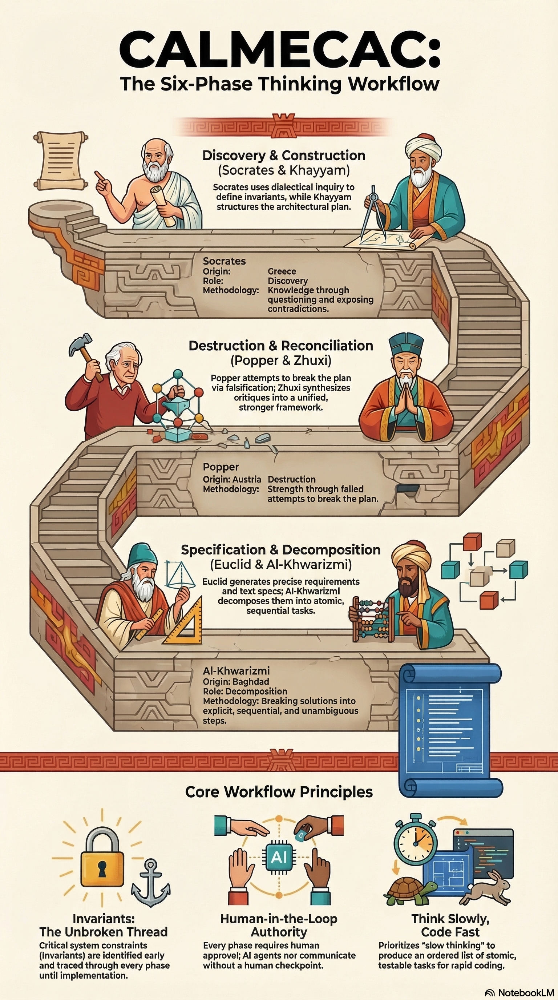

# Welcome to the Calmecac. Bring your idea. The teachers are waiting.

CALMECAC is named after the Aztec institution of higher learning. Its philosophy: think slowly and plan deliberately, so that coding can happen fast.

## Two Commands

```bash
just plan <model> <effort>     # Plan what to build (interactive)
just build <model> <effort>    # Build it (autonomous)
```

**Models:** `sonnet` (balanced), `opus` (strongest), `haiku` (fastest/cheapest)
**Effort:** `low`, `medium`, `high` — controls how much reasoning Claude applies per step

## Requirements

- [just](https://github.com/casey/just)
- [Claude Code](https://docs.anthropic.com/en/docs/claude-code)

## Quick Start

1. Click **"Use this template"** on GitHub and clone your repo
2. Create your project directory: `mkdir -p ~/dev/myproject`
3. Initialize git inside it: `cd ~/dev/myproject && git init`
4. Run `just plan sonnet high`
5. Run `just build sonnet high`

## What's Inside

```
Justfile                           ← your entry point
.claude/
├── skills/plan/                   ← the planning skill (six phases)
└── skills/build/                  ← Vera, the autonomous builder (loop runner)
```



## Docs

- [Personas](docs/personas.md) — the six teachers and Vera Rubin
- [Plan skill](.claude/skills/plan/SKILL.md) — the six-phase planning workflow
- [Build skill](.claude/skills/build/CLAUDE.md) — Vera's loop runner and task schema
